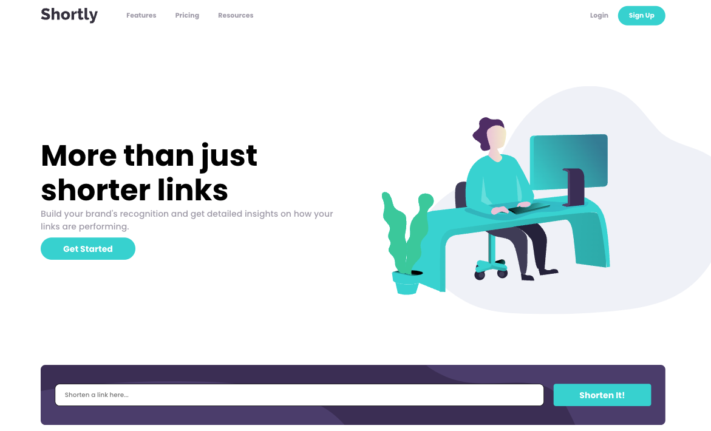
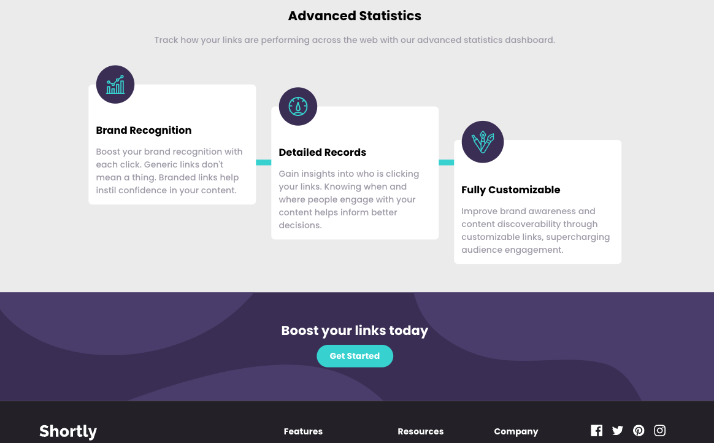

# Frontend Mentor - Shortly URL shortening API Challenge solution

This is a solution to the [Shortly URL shortening API Challenge challenge on Frontend Mentor](https://www.frontendmentor.io/challenges/url-shortening-api-landing-page-2ce3ob-G)

## Table of contents

- [Overview](#overview)
  - [The challenge](#the-challenge)
  - [Screenshots](#screenshots)
  - [Links](#links)
  - [Built with](#built-with)
- [Author](#author)
- [Acknowledgments](#acknowledgments)

## Overview

### The challenge

Users should be able to:

- View the optimal layout for the site depending on their device's screen size
- Shorten any valid URL
- See a list of their shortened links, even after refreshing the browser
- Copy the shortened link to their clipboard in a single click
- Receive an error message when the `form` is submitted if:
  - The `input` field is empty
  - The `input` is not a valid link
- Receive a successful message when the `form` is submitted if:
  - The link is correct

### Screenshots

### Links

- Solution URL: [https://github.com/Horos20/url-shortening-api-master](https://github.com/Horos20/url-shortening-api-master)
- Live Site URL: [https://horos20.github.io/url-shortening-api-master](https://horos20.github.io/url-shortening-api-master)

### Built with

- [React](https://reactjs.org/) - JS library
- CSS
- Mobile-first workflow

## Author

- Website - [Matis Rammi](https://matisrammi.com/)
